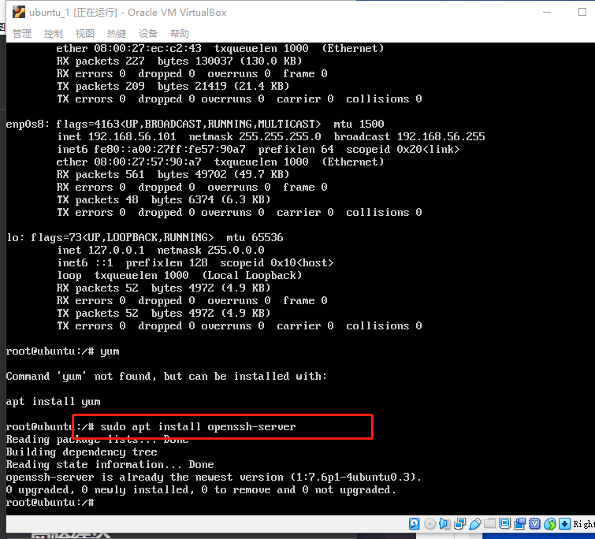
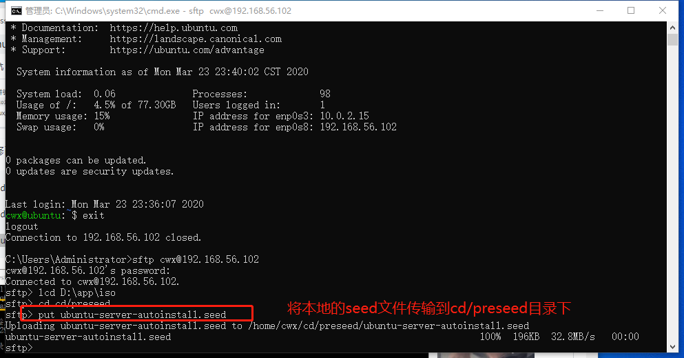
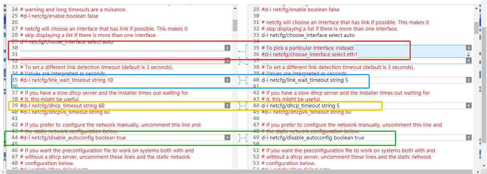

# 无人值守ISO镜像制作与安装

## 实验目的

+ 完成“无人值守”ISO镜像的制作
+ 利用制作好的ISO镜像，在virtualBox上执行无人安装

## 实验要求（完成度）

- [x] 无人值守iso镜像定制并安装

  - [x] 能定制用户名和默认密码

  - [x] 定制安装OpenSSH Server

  - [x] 安装过程禁止自动联网更新软件包
- [x] 完成以下问题
  - [x]  对比[官方示例文件](https://github.com/20LinuxManagement/assignment-01-purplezi/blob/master/第1次作业/seed/example.seed)和[老师文件](https://github.com/20LinuxManagement/assignment-01-purplezi/blob/master/第1次作业/seed/ubuntu-server-autoinstall.seed)的区别
  - [x] 设置双网卡：NAT + Host-only
  - [x]  Virtualbox安装完Ubuntu之后新添加的网卡如何实现系统开机自动启用和自动获取IP
  - [x] ssh免密登录,使用sftp在虚拟机和宿主机之间传输文件

## 实验先修知识（课堂笔记）

+ `man`命令常用大全

  ```bash
  sudo apt-get install manpages-dev #安装开发相关的manual
  man -a printf # 在所有section中查找主题为printf的手册页
  man -k printf # 在手册中查找printf的关键词
  man 3 printf #直接查看系统调用类帮助文档中主题名为printf的手册页	
  -h #帮助菜单
  ```

+ 自动补全命令行：TAB，重复输入命令：上下键，ctrl-R

+ echo:输出内容

+ cat：查看文件内容（无法滚屏）

+ less：查看文件内容（从第一行显示到最大的高度）

+ vim命令大全

+ sort,uniq,wc：排序，去重等等功能

+ 生成一个随机数：`openssl rand -hex 10`

## 实验环境

+ ### Ubuntu18.04 Server

  - 网卡：NAT、Host-Only
  - 镜像：ubuntu-18.04.4-server-amd64.iso

## 实验步骤

### 「有人值守」安装并完成基本配置及ssh登录

+ 先「有人值守」方式安装好 **一个可用的 Ubuntu 系统环境**（按照提示安装即可），其中，比较重要的一点是不选自动更新（为后续实验提供方便）,另外，可以选择安装openssh server，同样为后续实验做好准备

  

  

  
  
+ 为该系统设置双网卡，分别为NAT和host-only

  

+ 重启虚拟机通过`ifconfig`查看启用的网卡，发现只有一块启用了，再使用`ifconfig -a`查看所有网卡，发现第二块网卡未启用，于是使用`sudo ifconfig enp0s8 up`启用网卡，并使用`dhclient enp0s8`进行获取ip

  > 这里使用的是【网络安全】课程中的方法，作为复习！
  
  
  
+ 另一种设置方式如下

  ```bash
  sudo vi /etc/netplan/01-netcfg.yaml  #修改配置
  sudo netplan apply #启用设置
  ```

  

+ 接着查看网卡信息，发现成功启用
  
  
  
+ 安装openssh-server，发现安装包已安装（在安装系统时已有先见之明的安装好了）
  
  
  
+ 接着在本地物理机利用ssh连接，提前安装好了[chocolatey](https://chocolatey.org/)(及其好用的linux辅助工具)
  
  
  
  
  
+ 接下来借助git bash尝试ssh免密登录，最终连接成功

  ```bash
  生成密钥对：ssh-keygen -t rsa
  将公钥发送至服务器：ssh-copy-id cwx@192.168.56.102
  免密登录：ssh cwx@192.168.56.102
  ```

  
  
  
  
  

### 「sftp」在虚拟机和主机之间传输文件

+ 在本机上使用如下命令连接到虚拟机

  ```bash
  sftp cwx@192.168.56.101
  ```

  

+ 以下命令用于查看/切换本机/虚拟机的目录

  ```bash
  ls #查看虚拟机目录
  lls #查看本机目录
  lcd #切换本机目录
  cd #切换虚拟机的目录
  put +文件名 #将本机传输到虚拟机中
  get +文件名 #将虚拟机中文件下载到本机
  ```

  

+ 以上可以看到我们已经将iso发送到虚拟机中了，为接下来的镜像定制已做好准备

### 「无人值守」镜像定制

+ 将镜像挂载

  ```bash
  # 在当前用户目录下创建一个用于挂载iso镜像文件的目录
  mkdir loopdir
  
  # 挂载iso镜像文件到该目录
  sudo mount -o loop ubuntu-18.04.4-server-amd64.iso loopdir
  # 创建一个工作目录用于克隆光盘内容
  mkdir cd
   
  # 同步光盘内容到目标工作目录
  # 一定要注意loopdir后的这个/，cd后面不能有/
  rsync -av loopdir/ cd
  
  # 卸载iso镜像
  umount loopdir
  
  # 进入目标工作目录
  cd cd/
  
  # 编辑Ubuntu安装引导界面增加一个新菜单项入口
  vim isolinux/txt.cfg
  ```

  

  

+ 添加以下内容到该文件后强制保存退出

  ```
  label autoinstall
    menu label ^Auto Install Ubuntu Server
    kernel /install/vmlinuz
    append  file=/cdrom/preseed/ubuntu-server-autoinstall.seed debian-installer/locale=en_US console-setup/layoutcode=us keyboard-configuration/layoutcode=us console-setup/ask_detect=false localechooser/translation/warn-light=true localechooser/translation/warn-severe=true initrd=/install/initrd.gz root=/dev/ram rw quiet
  ```

  

+ vim常用命令（码上！）

  ```bash
  :w 保存文件但不退出vi
  :w file 将修改另外保存到file中，不退出vi
  :w! 强制保存，不推出vi
  :wq 保存文件并退出vi
  :wq! 强制保存文件，并退出vi
  :q 不保存文件，退出vi
  :q! 不保存文件，强制退出vi
  :e! 放弃所有修改，从上次保存文件开始再编辑命令历史
  ```

+ 提前阅读老师定制的示例[preseed.cfg](https://github.com/c4pr1c3/LinuxSysAdmin/blob/master/exp/chap0x01/cd-rom/preseed/ubuntu-server-autoinstall.seed)，并将该文件保存到刚才创建的工作目录`~/cd/preseed/ubuntu-server-autoinstall.seed`（使用sftp）

  

+ 可以看到虚拟机中已经在`cd/preseed`目录下

  

+ 修改isolinux/isolinux.cfg，增加内容`timeout 10`（可选，否则需要手动按下ENTER启动安装界面）

  

+ 生成iso

  ```bash
  # 重新生成md5sum.txt
  cd ~/cd && find . -type f -print0 | xargs -0 md5sum > md5sum.txt
  
  # 封闭改动后的目录到.iso
  IMAGE=custom.iso
  BUILD=~/cd/
  
  mkisofs -r -V "Custom Ubuntu Install CD" \
              -cache-inodes \
              -J -l -b isolinux/isolinux.bin \
              -c isolinux/boot.cat -no-emul-boot \
              -boot-load-size 4 -boot-info-table \
              -o custom.iso .
  
  # 如果目标磁盘之前有数据，则在安装过程中会在分区检测环节出现人机交互对话框需要人工选择
  ```
  
  
  
+ 安装所需的包以后成功生成iso

  

+ 接着将生成的iso传到主机

  
  
+ 至此，我们已经获得了一个已经定制好的镜像，接着新建虚拟机并安装ubuntu系统，实现无人值守（期间去吃了个午饭~）

  

+ 使用预先的用户名密码登录，则安装成功（用户名:cuc，密码:sec.cuc.edu.cn 详见实验结论分析）
  
  
  
  
  
+ 以下是全过程录屏gif (全长约4分钟)
  
  
  
+ 安装过程原视频，[点击此处](https://member.bilibili.com/v2#/upload-manager/article)[审核中]

## 实验所遇问题

+ virtualbox显示无法打开一个新任务，安装`D:\app\virtualbox\drivers\vboxdrv`下的`VBoxDrv.inf`后成功

+ 修改`/etc/network/interfaces`配置时显示该版本需要使用netplan进行配置

+ 挂载镜像时显示如下错误：loopdir: failed to setup loop device for ubuntu-18.04.4-server-amd64.iso.原因是iso还未传到虚拟机中

+ 重装虚拟机后ssh连接失败，原因是ssh的公私钥对改变了，需要使用如下命令重新生成

  ```bash
  ssh-keygen -R 服务器端的ip地址
  ```

+ put seed文件到preseed以及修改md5sum.txt时，会提示权限不足，`ls -l +文件名`可以查看文件权限，使用chmod可以修改文件权限

  ```bash
  chmod a+w cd/preseed
  ```

+ apt update过于慢，更换了源后快的多了

  ```bash
  # 首先备份源列表
  sudo cp /etc/apt/sources.list /etc/apt/sources.list_backup
  # 打开sources.list文件
  sudo gedit /etc/apt/sources.list
  #  阿里源
  deb http://mirrors.aliyun.com/ubuntu/ bionic main restricted universe multiverse
  deb http://mirrors.aliyun.com/ubuntu/ bionic-security main restricted universe multiverse
  deb http://mirrors.aliyun.com/ubuntu/ bionic-updates main restricted universe multiverse
  deb http://mirrors.aliyun.com/ubuntu/ bionic-proposed main restricted universe multiverse
  deb http://mirrors.aliyun.com/ubuntu/ bionic-backports main restricted universe multiverse
  deb-src http://mirrors.aliyun.com/ubuntu/ bionic main restricted universe multiverse
  deb-src http://mirrors.aliyun.com/ubuntu/ bionic-security main restricted universe multiverse
  deb-src http://mirrors.aliyun.com/ubuntu/ bionic-updates main restricted universe multiverse
  deb-src http://mirrors.aliyun.com/ubuntu/ bionic-proposed main restricted universe multiverse
  deb-src http://mirrors.aliyun.com/ubuntu/ bionic-backports main restricted universe multiverse
  ```

  


## 实验结论

+ 个人理解：所谓的【无人值守】即是提前做好所有配置，节省了在安装过程中的交互过程

+ ubuntu-server-autoinstall.seed与[官方示例](https://help.ubuntu.com/lts/installation-guide/example-preseed.txt)对比，使用的是[在线文档对比工具](https://www.qianbo.com.cn/Tool/Text-Difference/)

  + 选择地点；跳过语言支持的选项

    

  + 网卡设置；增加超时设置，并修改时间为5s；增加dhcp超时设置，并修改时间为5s；启用手工配置网络选项

    

  + 设置IP地址为自定义；设置网关；设置域名服务器；设置弹窗确认为true；设置默认主机名；设置默认域名；

    

  + 强制主机名

    
    
  + 设置用户名和密码
    
    
    
  + 设置时区为上海并关闭时钟校准
    
    
    
  + 选取最大空闲分区
    
    
    
  + LVM分区，选择尽可能多的分区并更改分区为multi
    
    
    
  + 不使用网络镜像
    
    
    
  + 选择安装模式为server；安装openssh-server；不进行自动更新；自动进行安全更新
    
    
    
    

## 实验参考资料

+ [基于官方iso格式安装镜像制作无人值守定制安装镜像](https://help.ubuntu.com/community/InstallCDCustomization)
+ [ubuntu示例文件](https://help.ubuntu.com/lts/installation-guide/example-preseed.txt)
+ [镜像配置](https://github.com/c4pr1c3/LinuxSysAdmin/blob/master/chap0x01.exp.md)
+ [ssh错误解决](https://www.cnblogs.com/nucdy/p/5664257.html)
+ [linux目录介绍](https://blog.csdn.net/qq_36412715/article/details/83150793)
+ [linux课本](https://github.com/c4pr1c3/LinuxSysAdmin)

