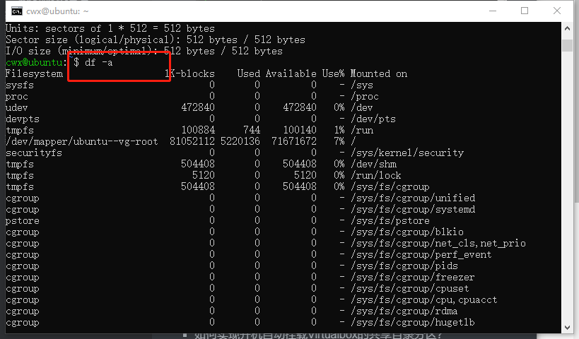

# Linux服务器系统管理

## 实验目的

+ 熟练运用`systemd`进行开机自启动项管理

## 实验要求

- [x]  动手实战SYSTEMD
- [x] 自查清单

## 实验环境

- Ubuntu18.04 Server
  - 网卡：NAT、Host-Only

## 实验先修知识（课堂笔记）

+ tmux

  ```bash
  # 开启一个tmux会话
  tmux
  # CTRL-B d 脱离(detach)当前tmux会话
  # 再开启一个tmux会话
  tmux
  # CTRL-B d 再脱离(detach)当前tmux会话
  # 查看当前可用的tmux会话列表
  tmux ls
  # 连接到会话编号0的会话
  tmux attach -t 0
  # 退出并关闭当前会话
  exit
  ```

+ chown

+ chgrp

+ chmod

+ umask

  ```bash
  # 设置SUID
  chmod 4755 filename
  
  # 设置SGID
  chmod 2755 dirname
  
  # 同时设置SUID和SGID（罕见）
  chmod 6755 filename
  
  # 设置Sticky Bit
  chmod 1755 dirname
  ```

+ shell内部命令无法sudo
+ 文件系统格式
  - ext3 / ext4 / swap
  - mkfs
+ 文件分区
  - 分区原则与策略
  - fdisk
  - 大于2TB分区支持使用 [parted](https://www.cyberciti.biz/tips/fdisk-unable-to-create-partition-greater-2tb.html)
+ 文件系统挂载
  - U盘 / NFS / iso / 光盘
  - /etc/fstab
+ 文件备份、文件恢复
+ Systemd - 特性（优点）
  - 提供了积极的（服务、进程）并行化启动能力
  - 使用socket 和 D-Bus 机制来激活启动服务
  - 提供了按需启动守护进程能力
  - 实现了基于事务风格依赖管理的服务控制逻辑
  - 使用Linux的cgroup机制管理进程
  - 支持快照和还原
  - 维护挂载和自动挂载点

## 实验步骤

+ Systemd 入门教程：命令篇

  + 第1-3节学习视频

    [](https://asciinema.org/a/i0HkWG3QsKr3ziHiZm2sUZa1K)

  + 第4节学习视频
  
    [](https://asciinema.org/a/CXs8y2gDQbTjwVdyXfukoI1sk)
  
  + 第五节学习视频
  
    [](https://asciinema.org/a/NUUVjN2241UIVmzZoR40RH5lv)
  
  + 第六节学习视频
  
    [](https://asciinema.org/a/oNJ2hqkLZ71EDAXOtOkI9P248)
  
  + 第七节学习视频
  
    [](https://asciinema.org/a/IvnLM49m3sSaG1g9Oz88Bb6Xv)

+ Systemd 入门教程：实战篇

  + 第1-3节学习视频

    [](https://asciinema.org/a/fBkcS8kPXt1Bj418CcfTTiexX)

  + 第4-7节学习视频

    [](https://asciinema.org/a/GGOzKF7R1H4hhPGCRyX76fP1k)
  
  + 第8-9节学习视频
  
    [](https://asciinema.org/a/qYf7a60O408C4p0xsE8b7t9B2)

## 实验所遇问题

+ 挂载共享文件夹时一直没有成功，原因是添加配置时格式不正确

  ```bash
   vbshare /home/cwx/shared vboxsf defaults 0 0
  #写入这一条命令时，在改行的开头，一定要空一格，否则无效
  ```

+ `asciinema`录制时需要先认证登录，否则隔段时间录屏就过期了

## 实验总结（自查清单）

- 如何添加一个用户并使其具备sudo执行程序的权限？

  ```bash
   # 添加一个用户
   # sudo adduser username
   sudo adduser exp
  
   # 切换到该用户
   # su username
   su exp
  
   # 无法执行sudo
   sudo vim words
  
   # 退出
   exit
  
   # 添加用户到sudo组
   # sudo usermode -aG groupname username
   # -a, --append                  append the user to the supplemental GROUPS mentioned by the -G option without removing him/her from other groups
   #  -G, --groups GROUPS           new list of supplementary GROUPS
   sudo usermod -aG sudo exp
  
   # 添加完后，切换到该用户
   su exp
  
   # 此时已经可以执行sudo
   sudo su -
  ```

  

- 如何将一个用户添加到一个用户组？

  ```bash
  sudo usermode -aG groupname username
  ```

  

- 如何查看当前系统的分区表和文件系统详细信息？

  ```bash
   sudo fdisk -l # 查看当前系统的分区表（小于2T）
   df -a# 查看文件系统详细信息
  ```

  

  

- 如何实现开机自动挂载Virtualbox的共享目录分区？

  ```bash
  #VirtualBox中选择设置->共享文件夹->添加共享文件夹，选择要和虚拟机共享的文件夹(此处为vbox_share)，并勾选自动挂载
  
  # 在虚拟机内进行相关设置
  
   # 创建挂载目录
   mkdir ~/shared
  
   #安装增强功能
   sudo apt install nfs-common
   sudo apt install cifs-utils
   sudo apt install virtualbox-guest-utils
  #挂载文件夹
   sudo mount -t vboxsf vbox_share ~/shared
  
   # 修改配置
   sudo vim /etc/fstab
  
   # 配置内容如下
   vbshare ~/shared vboxsf defaults 0 0
  
   # 重启
   reboot
   
   df #查看文件状态及位置等信息，并进入对应文件夹查看是否挂载成功
  ```

  

  

  

- 基于LVM（逻辑分卷管理）的分区如何实现动态扩容和缩减容量？

  ```bash
   # 显示逻辑卷信息
   sudo lvdisplay
  
   # 扩容
   sudo lvextend -L +16M /dev/ubuntu-vg/root
  
   # 缩容
   sudo lvreduce -L -16M /dev/ubuntu-vg/root
  ```

  

  

  

- 如何通过systemd设置实现在网络连通时运行一个指定脚本，在网络断开时运行另一个脚本？

  ```bash
  #通过修改networking.service实现
  #在/lib/systemd/system/下的networkd-dispatcher.service添加ExecStartPost=/bin/bash 脚本路径和ExecStopPost=/bin/bash 脚本路径（暂未成功，原因是没有修改该文件的权限)
  ExecStartPre=/bin/bash /home/cwx/after.sh                                     ExecStopPost=/bin/bash /home/cwx/before.sh 
  ```
  
  
  
- 如何通过systemd设置实现一个脚本在任何情况下被杀死之后会立即重新启动？实现***杀不死***？

  ```bash
  #编写相关的.service文件，在文件中的Service区块处增加Restart=always即可
  # 具体步骤
  
  
  # 编辑脚本
  vi mytest

  # 以下为脚本内容
  #!/bin/bash
  echo "just for testing"

  # 创建并编辑配置文件
  sudo vi /lib/systemd/system/mytest.service

  # 以下为配置文件内容
  [Unit]
  Description=My Script

  [Service]
  Type=forking
  ExecStart=/usr/bin/mytest
  ExecStop=/usr/bin/mytest
  Restart=always
  RestartSec=42s
  RemainAfterExit=yes

  [Install]
  WantedBy=multi-user.target
  # 重新加载配置文件
  systemctl daemon-reload
  ```
  
  
  
  
  
  
  
  

## 实验参考资料

+ [LVM](https://wiki.ubuntu.com/Lvm)
+ [共享文件夹](https://askubuntu.com/questions/252853/how-to-mount-a-virtualbox-shared-folder-at-startup)
+ [systemd](https://en.wikipedia.org/wiki/Systemd)
+ [systemd教程-命令篇](http://www.ruanyifeng.com/blog/2016/03/systemd-tutorial-commands.html)
+ [systemd教程-实战篇](http://www.ruanyifeng.com/blog/2016/03/systemd-tutorial-part-two.html)
+ [共享文件夹解决问题](https://blog.csdn.net/baidu_31788709/article/details/89154265)
+ [asciinema的markdown书写格式](https://zhuanlan.zhihu.com/p/28423868)

