# shell脚本编程基础

## 实验目的

+ 熟练运用shell脚本进行编程

## 实验先修知识（课堂笔记）

+ bash代码首行

  ```bash
  #!/usr/bin/env bash
  #注释符号 #
  #文件起始处的 #! 声明自己是一个脚本文件
  #当前shell脚本默认使用的解释器
  #查看当前正在使用shell解释器
  ```

+ 变量使用

  ```bash
  $+变量名 #引用
  ```

  - 变量名区分大小写
  - **=**左右两边不能有空格
  - 单引号包围的字符串中不对特殊符号做解释执行
  - 双引号包围的字符串中对特殊符号解释执行
  - 使用 **\** 转义特殊符号避免被解释执行

+ 脚本调试

  ```bash
  # 调试模式运行，逐行执行“命令”并打印“命令”接受的输入参数值
  $ bash -x <script.sh>
  
  # 代码片段临时开启调试模式
  set -x          # activate debugging from here
  w
  set +x          # stop debugging from here
  
  # 写文件
  echo -e "$msg" >> /tmp/debug.log
  
  # 如果打印变量内容包含「不可打印字符」
  # msg="hello world\x01\x02"
  echo -n -e "$msg" | xxd -p >> /tmp/debug.log #二进制内容以十六进制写到文件中
  ```

+ 脚本传参

  - 参照使用C语言代码编写的命令行可执行程序传参语法规范
  - 参数与参数之间、脚本文件名与参数之间使用1个或多个空格分隔
  - `$0` 指代脚本文件本身
  - `$1` 指代命令行上的第1个参数
  - `$2` 指代命令行上的第2个参数，以此类推其他参数的脚本内引用方法
  - `$@` 指代命令行上的所有参数（参数数组）
  - `$#` 指代命令行上的参数个数（参数数组大小）

+ 数组

  - [Bash 4.0 开始支持关联数组](https://www.tldp.org/LDP/abs/html/bashver4.html)
  - `declare -a` 声明的是「索引」数组，`declare -A` 声明的是「关联」数组。[如果同时使用 `-a -A` ，`-A` 优先级更高，数组被声明为「关联」数组](https://www.gnu.org/software/bash/manual/html_node/Arrays.html)
  - [Bash 4.2](https://stackoverflow.com/questions/10806357/associative-arrays-are-local-by-default) 开始支持 `declare -g` 方式声明关联数组为「全局」变量，在此之前，关联数组仅限局部变量作用域

+ 基本算术运算

+ 基本字符串操作

+ 条件判断

  ```bash
  if [ expression ]; then
  
  # code if 'expression' is true
  
  elif [ expression ]; then
  
  # code if 'expression' is true
  
  else
  
  # other conditions
  
  fi
  ```

+ 循环(for循环)

  ```bash
  # basic construct
  for arg in [list]
  do
   command(s)...
  done
  
  # 单行结构
  for arg in [list];do command(s)...;done
  ```

+ `shellcheck`进行脚本错误检查

+ 函数

  函数调用、传参和参数处理

  ```
  function function_B {
    echo "Function B."
  }
  function function_A {
    echo "$1"
  }
  function adder {
    echo "$(($1 + $2))"
  }
  
  # 调用函数，传参
  function_A "Function A."     # Function A.
  function_B                   # Function B.
  adder 12 56                  # 68
  ```

  函数定义

  ```bash
  # 基本定义方法，可移植性最好
  function_name () compound-command [ redirections ]
  
  # 现代主流shell解释权均支持的语法，可以避免alias机制污染函数名
  function function_name [()] compound-command [ redirections ]      
  ```

+ 文件读写

  ```bash
  # 利用I/O重定向机制
  
  # 清空一个文件（文件大小变为0）
  > file
  # 用一段文本内容覆盖一个文件
  echo "some string" > file
  # 在文件尾部追加内容
  echo "some string" >> file
  
  # 读取文件的第一行并将其赋值给一个变量
  
  # read是bash的内置函数
  # read命令会从标准输入读取一行，并将其赋值给变量line。-r选项表示read将读取原生内容，所有字符都不会被转义，例如反斜线不会用于转义（只是反斜线）。输入重定向命令"<file"会打开文件并执行读操作，并且会将读取的内容以标准输入的形式提供给read命令。
  read -r line < file
  # read命令会删除特殊变量IFS所表示的字符。IFS是Internal Field Separator（内部字段分隔符）的缩写，它的值为用于分隔单词和行的字符组成的字符串。IFS的默认值为空格符、制表符和换行符组成的字符串。这意味着前导和尾随的空格符和制表符都会被删除。如果你想保留这些字符，你可以将IFS设置为空字符：
  IFS= read -r line < file
  # 利用外部程序head
  line=$(head -1 file)
  line=`head -1 file`
  
  # 构造一个「畸形」测试用例
  echo -n -e " 123 \x0a456" > file
  # 逐行读文件 **有 BUG**
  while read -r line; do
        # do something with $line
        echo "$line" | xxd -p
  done < file
  # 逐行读文件，防止行两端的空白字符被删除 **依然有 BUG**
  while IFS= read -r line; do
        # do something with $line
        echo "$line" | xxd -p
  done < file
  # 文件读写的最佳实践
  while IFS= read -r line || [[ -n "$line" ]]; do
        # do something with $line
        echo "$line" | xxd -p
  done < file
  ```

## 实验要求（完成度）

- [x]  任务一：用bash编写一个图片批处理脚本，实现以下功能：
  - [x] 支持命令行参数方式使用不同功能
  - [x]  支持对指定目录下所有支持格式的图片文件进行批处理
  - [x] 支持以下常见图片批处理功能的单独使用或组合使用
  - [x] 支持对jpeg格式图片进行图片质量压缩
  - [x] 支持对jpeg/png/svg格式图片在保持原始宽高比的前提下压缩分辨率
  - [x] 支持对图片批量添加自定义文本水印
  - [x] 支持批量重命名（统一添加文件名前缀或后缀，不影响原始文件扩展名）
  - [x] 支持将png/svg图片统一转换为jpg格式图片

- [x]  任务二：用bash编写一个文本批处理脚本，对以下附件[2014世界杯运动员数据](https://github.com/c4pr1c3/LinuxSysAdmin/blob/master/exp/chap0x04/worldcupplayerinfo.tsv)分别进行批量处理完成相应的数据统计任务：
  - [x] 统计不同年龄区间范围（20岁以下、[20-30]、30岁以上）的球员数量、百分比
  - [x] 统计不同场上位置的球员数量、百分比
  - [x] 名字最长的球员是谁？名字最短的球员是谁？
  - [x] 年龄最大的球员是谁？年龄最小的球员是谁？

- [x]  任务三：用bash编写一个文本批处理脚本，对以下附件[Web服务器访问日志](https://github.com/c4pr1c3/LinuxSysAdmin/blob/master/exp/chap0x04/web_log.tsv.7z)

   分别进行批量处理完成相应的数据统计任务：

  - [x]  统计访问来源主机TOP 100和分别对应出现的总次数

  - [x]  统计访问来源主机TOP 100 IP和分别对应出现的总次数
  - [x] 统计最频繁被访问的URL TOP 100
  - [x]  统计不同响应状态码的出现次数和对应百分比
  - [x] 分别统计不同4XX状态码对应的TOP 10 URL和对应出现的总次数
  - [x] 给定URL输出TOP 100访问来源主机

## 实验环境

+ VirtualBox
  + ubuntu-18.04.1-server-amd64
  + GNU bash

## 实验步骤

+ 任务一

  + [源代码](./sh/task1-1.sh)

  - 帮助

    ```bash
    ./task1-1.sh --help
    ```

    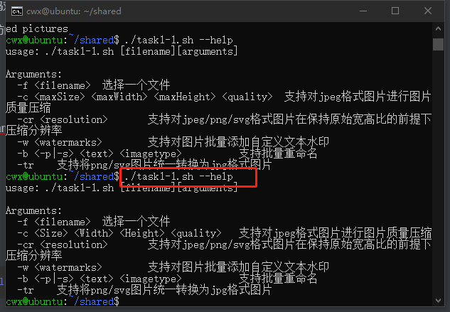

  - 支持对jpeg格式图片进行图片质量压缩

    ```
      # 用法： ./task1-1.sh -f 文件或文件夹路径 -c 图片大小 高 宽 压缩图片质量
      ./task1-1.sh -f ~/shared -c 1M 1280 1280 85 #实例
    ```

    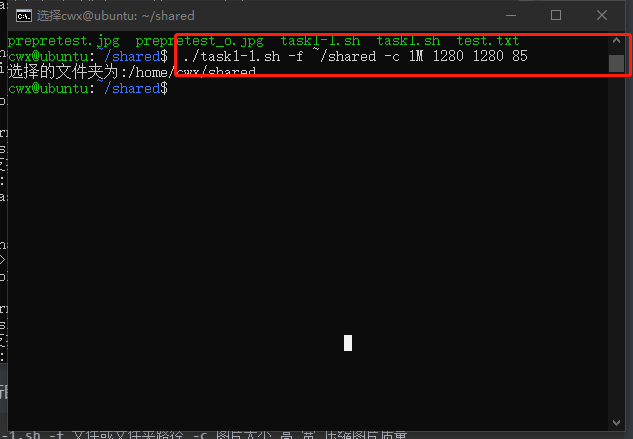

  - 支持对jpeg/png/svg格式图片在保持原始宽高比的前提下压缩分辨率

    ```
      #用法：./task1-1.sh -f 文件或文件夹路径 -cr 压缩分辨率
      ./task1-1.sh -f ~/shared/test.jpg -cr 1380x640
    ```

    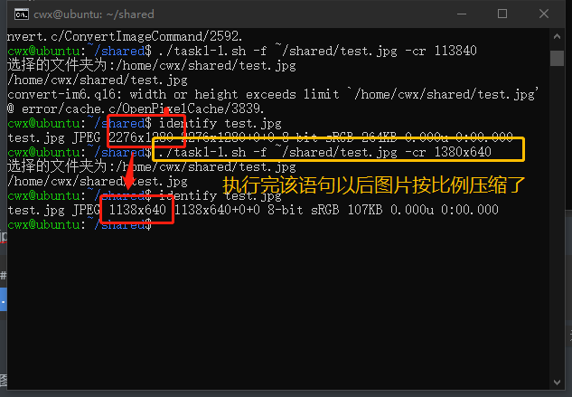

  - 支持对图片批量添加自定义文本水印

    ```
      # ./task1-1.sh -f 文件或文件夹路径 -w 水印内容
      ./task1-1.sh -f ~/shared -w cwx
    ```

    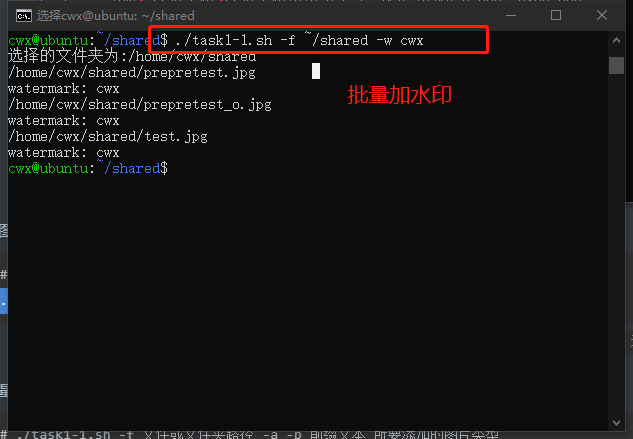

  - 支持批量重命名（统一添加文件名前缀或后缀，不影响原始文件扩展名）

    ```
      # ./task1-1.sh -f 文件或文件夹路径 -b -p 前缀 所要添加的图片类型
      ./task1-1.sh -f ~/shared -b -p my jpg
    
      # ./task1-1.sh -f 文件或文件夹路径 -a -s 后缀 所要添加的图片类型
      ./task1-1.sh -f ~/shared -b -s my jpg
    ```

    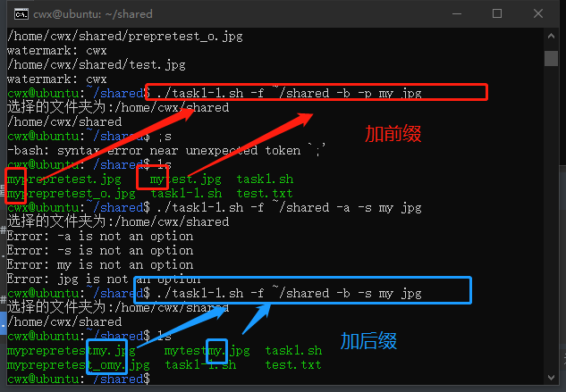

  - 支持将png/svg图片统一转换为jpg格式图片

    ```
      # ./task1-1.sh -f 文件或文件夹路径 -tr
      ./task1-1.sh -f ~/shared -tr
    ```

    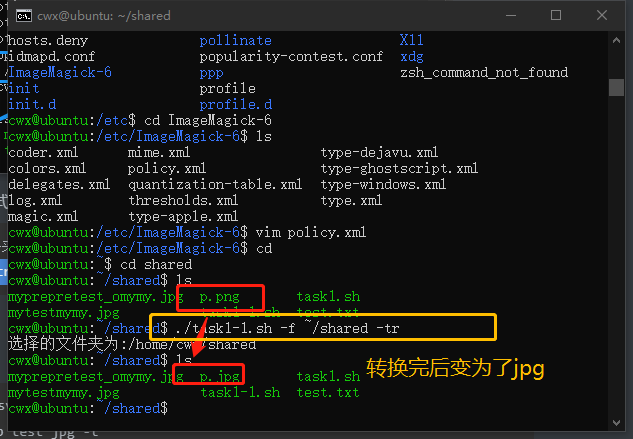

  - 组合命令举例

    ```
      # 修改文件分辨率，并添加后缀
     ./task1-1.sh -f ~/shared/test.jpg -cr 690x320 -b -s end jpg
    ```

    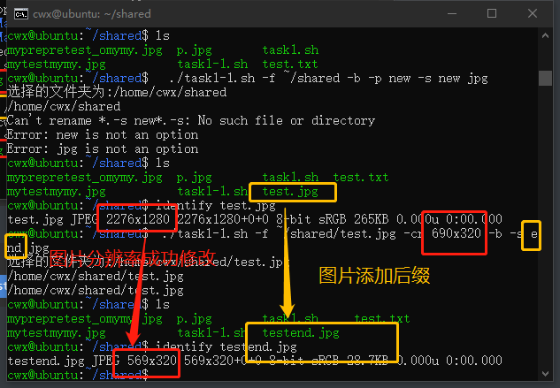


+ 任务二

  + [源代码](./sh/task2-2.sh)

  + 帮助

    ```bash
    ./task2-2.sh worldcupplayerinfo.tsv --help
    ```

    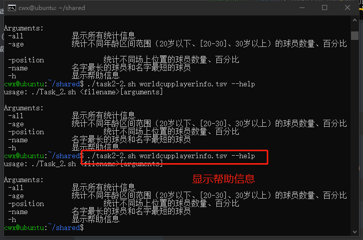
  
  + 统计不同年龄区间范围（20岁以下、[20-30]、30岁以上）的球员数量、百分比
  
    ```bash
    ./task2-2.sh worldcupplayerinfo.tsv -age
    ```
  
    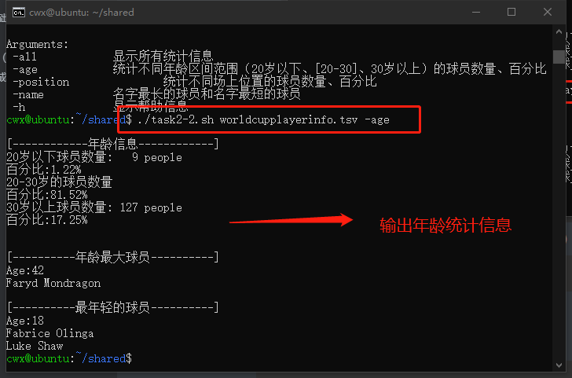
  
    ```bash
    #统计信息
    [------------年龄信息------------]
    20岁以下球员数量:   9 people
    百分比:1.22%
    20-30岁的球员数量
    百分比:81.52%
    30岁以上球员数量: 127 people
    百分比:17.25%
    
    
    [----------年龄最大球员----------]
    Age:42
    Faryd Mondragon
    
    [----------最年轻的球员----------]
    Age:18
    Fabrice Olinga
    Luke Shaw
    ```
  
  + 统计不同场上位置的球员数量、百分比
  
    ```bash
    ./task2-2.sh worldcupplayerinfo.tsv -position
    ```
  
    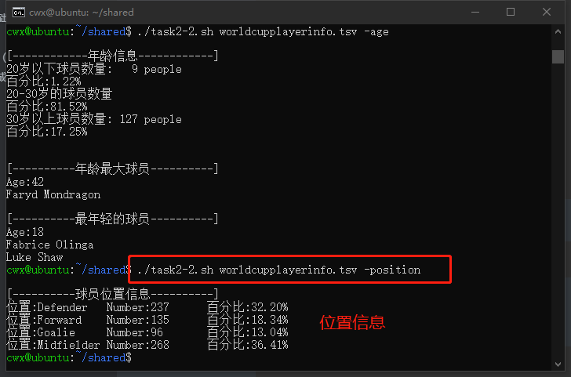
  
    ```bash
    #统计信息
    [----------球员位置信息----------]
    位置:Defender   Number:237      百分比:32.20%
    位置:Forward    Number:135      百分比:18.34%
    位置:Goalie     Number:96       百分比:13.04%
    位置:Midfielder Number:268      百分比:36.41%
    ```
  
  + 名字最长的球员是谁？名字最短的球员是谁？
  
    ```
    ./task2-2.sh worldcupplayerinfo.tsv -name
    ```
  
    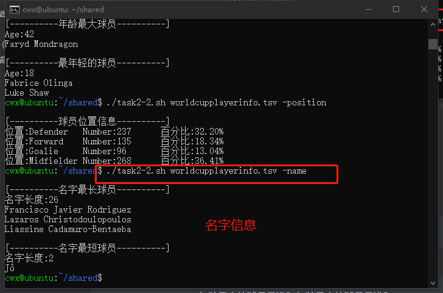
  
    ```bash
    #统计信息
    [----------名字最长球员----------]
    名字长度:26
    Francisco Javier Rodriguez
    Lazaros Christodoulopoulos
    Liassine Cadamuro-Bentaeba
    
    [----------名字最短球员----------]
    名字长度:2
    Jô
    ```
  
  + 年龄最大的球员是谁？年龄最小的球员是谁？
  
    ```bash
    #该条信息在统计年龄信息时顺便也统计并输出了
    [----------年龄最大球员----------]
    Age:42
    Faryd Mondragon
    
    [----------最年轻的球员----------]
    Age:18
    Fabrice Olinga
    Luke Shaw
    ```
  
  + 输出所有信息
  
    ```bash
    ./task2-2.sh worldcupplayerinfo.tsv -all
    ```
  
    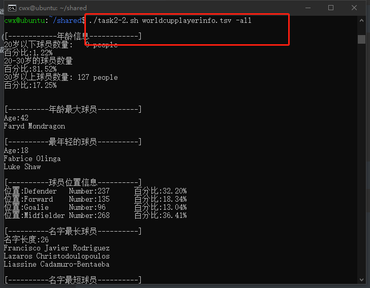
  
    ```bash
    [------------年龄信息------------]
    20岁以下球员数量:   9 people
    百分比:1.22%
    20-30岁的球员数量
    百分比:81.52%
    30岁以上球员数量: 127 people
    百分比:17.25%
    
    
    [----------年龄最大球员----------]
    Age:42
    Faryd Mondragon
    
    [----------最年轻的球员----------]
    Age:18
    Fabrice Olinga
    Luke Shaw
    
    [----------球员位置信息----------]
    位置:Defender   Number:237      百分比:32.20%
    位置:Forward    Number:135      百分比:18.34%
    位置:Goalie     Number:96       百分比:13.04%
    位置:Midfielder Number:268      百分比:36.41%
    
    [----------名字最长球员----------]
    名字长度:26
    Francisco Javier Rodriguez
    Lazaros Christodoulopoulos
    Liassine Cadamuro-Bentaeba
    
    [----------名字最短球员----------]
    名字长度:2
    Jô
    ```


+ 任务三

  + 实验之前将数据信息压缩

    ```bash
     sudo apt install p7zip-full #安装压缩工具
     7z x web_log.tsv.7z #解压缩
    ```

    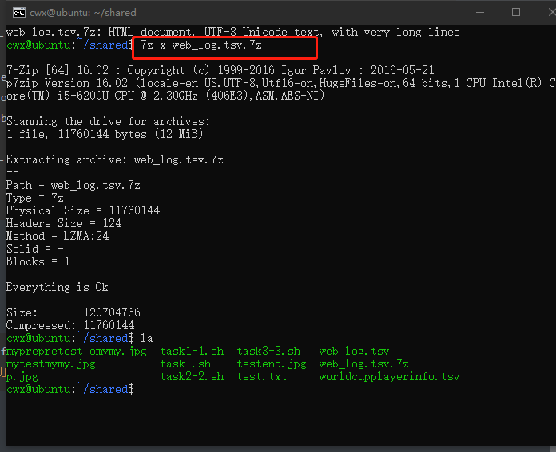

  + [源代码](./sh/task3-3.sh)

  + 帮助

    ```bash
    ./task3-3.sh web_log.tsv --help
    ```

    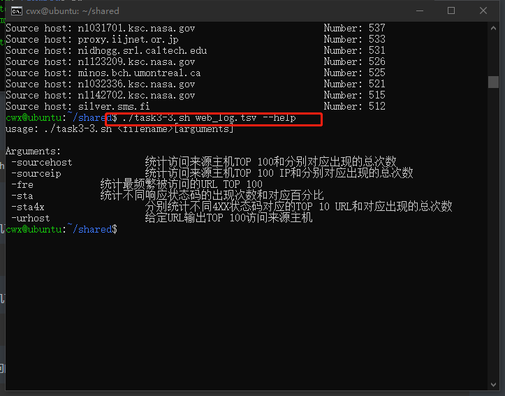

  + 统计访问来源主机TOP 100和分别对应出现的总次数
  
    ```bash
  ./task3-3.sh web_log.tsv -sourcehost
    ```

    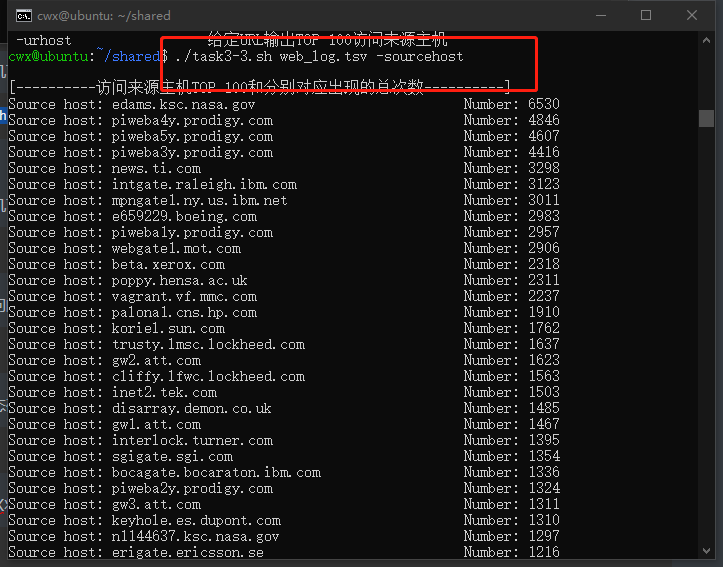
  
    ```bash
  [----------访问来源主机TOP 100和分别对应出现的总次数----------]
    Source host: edams.ksc.nasa.gov                          Number: 6530
  Source host: piweba4y.prodigy.com                        Number: 4846
    Source host: piweba5y.prodigy.com                        Number: 4607
    Source host: piweba3y.prodigy.com                        Number: 4416
    Source host: news.ti.com                                 Number: 3298
  Source host: intgate.raleigh.ibm.com                     Number: 3123
    Source host: mpngate1.ny.us.ibm.net                      Number: 3011
  Source host: e659229.boeing.com                          Number: 2983
    Source host: piweba1y.prodigy.com                        Number: 2957
    Source host: webgate1.mot.com                            Number: 2906
    Source host: beta.xerox.com                              Number: 2318
  Source host: poppy.hensa.ac.uk                           Number: 2311
    Source host: vagrant.vf.mmc.com                          Number: 2237
  Source host: palona1.cns.hp.com                          Number: 1910
    Source host: koriel.sun.com                              Number: 1762
    Source host: trusty.lmsc.lockheed.com                    Number: 1637
    Source host: gw2.att.com                                 Number: 1623
  Source host: cliffy.lfwc.lockheed.com                    Number: 1563
    Source host: inet2.tek.com                               Number: 1503
    Source host: disarray.demon.co.uk                        Number: 1485
    Source host: gw1.att.com                                 Number: 1467
    Source host: interlock.turner.com                        Number: 1395
    Source host: sgigate.sgi.com                             Number: 1354
    Source host: bocagate.bocaraton.ibm.com                  Number: 1336
    Source host: piweba2y.prodigy.com                        Number: 1324
    Source host: gw3.att.com                                 Number: 1311
    Source host: keyhole.es.dupont.com                       Number: 1310
    Source host: n1144637.ksc.nasa.gov                       Number: 1297
    Source host: erigate.ericsson.se                         Number: 1216
    Source host: gn2.getnet.com                              Number: 1211
    Source host: gwa.ericsson.com                            Number: 1089
    Source host: tiber.gsfc.nasa.gov                         Number: 1079
    Source host: bstfirewall.bst.bls.com                     Number: 1017
    Source host: spider.tbe.com                              Number: 1013
    Source host: gatekeeper.us.oracle.com                    Number: 1010
    Source host: whopkins.sso.az.honeywell.com               Number: 984
    Source host: news.dfrc.nasa.gov                          Number: 966
    Source host: proxy0.research.att.com                     Number: 940
    Source host: proxy.austin.ibm.com                        Number: 925
    Source host: bbuig150.unisys.com                         Number: 901
    Source host: corpgate.nt.com                             Number: 899
    Source host: sahp315.sandia.gov                          Number: 890
    Source host: amdext.amd.com                              Number: 869
    Source host: n1121796.ksc.nasa.gov                       Number: 830
    Source host: igate.uswest.com                            Number: 825
    Source host: gatekeeper.cca.rockwell.com                 Number: 819
    Source host: wwwproxy.sanders.com                        Number: 815
    Source host: gw4.att.com                                 Number: 814
    Source host: goose.sms.fi                                Number: 812
    Source host: jericho3.microsoft.com                      Number: 805
    Source host: jericho2.microsoft.com                      Number: 786
    Source host: sdn_b6_f02_ip.dny.rockwell.com              Number: 782
    Source host: lamar.d48.lilly.com                         Number: 778
    Source host: heimdallp2.compaq.com                       Number: 772
    Source host: stortek1.stortek.com                        Number: 771
    Source host: mac998.kip.apple.com                        Number: 759
    Source host: tia1.eskimo.com                             Number: 742
    Source host: reddragon.ksc.nasa.gov                      Number: 715
    Source host: rmcg.cts.com                                Number: 701
    Source host: bambi.te.rl.ac.uk                           Number: 701
    Source host: electron.mcc.com                            Number: 697
    Source host: pinta.csee.usf.edu                          Number: 689
    Source host: n1040681.ksc.nasa.gov                       Number: 676
    Source host: gatekeeper.mitre.org                        Number: 670
    Source host: hpcvsop.cv.hp.com                           Number: 669
    Source host: screen.lotus.com                            Number: 667
    Source host: metabelis.rmit.edu.au                       Number: 666
    Source host: orpheus.amdahl.com                          Number: 657
    Source host: proxy.bellatlantic.com                      Number: 654
    Source host: n1376232.ksc.nasa.gov                       Number: 652
    Source host: n1131455.ksc.nasa.gov                       Number: 645
    Source host: n1123413.ksc.nasa.gov                       Number: 642
    Source host: zooropa.res.cmu.edu                         Number: 632
    Source host: fkirchman.gsfc.nasa.gov                     Number: 612
    Source host: theopolis.orl.mmc.com                       Number: 611
    Source host: n1123543.ksc.nasa.gov                       Number: 611
    Source host: ntigate.nt.com                              Number: 610
    Source host: pc24.ac.tandem.com                          Number: 606
    Source host: euas65.eua.ericsson.se                      Number: 596
    Source host: scooter.pa-x.dec.com                        Number: 592
    Source host: neuron.bms.com                              Number: 572
    Source host: ottgate2.bnr.ca                             Number: 569
    Source host: n1144796.ksc.nasa.gov                       Number: 569
    Source host: relay02.jpmorgan.com                        Number: 556
    Source host: duckling.omsi.edu                           Number: 556
    Source host: sophocles.algonet.se                        Number: 551
    Source host: ftp.mel.aone.net.au                         Number: 548
    Source host: magicall.dacom.co.kr                        Number: 543
    Source host: snoopy.tblc.lib.fl.us                       Number: 541
    Source host: n1031729.ksc.nasa.gov                       Number: 540
    Source host: miriworld.its.unimelb.edu.au                Number: 540
    Source host: pl01265.ksc.nasa.gov                        Number: 539
    Source host: n1031701.ksc.nasa.gov                       Number: 537
    Source host: proxy.iijnet.or.jp                          Number: 533
    Source host: nidhogg.srl.caltech.edu                     Number: 531
    Source host: n1123209.ksc.nasa.gov                       Number: 526
    Source host: minos.bch.umontreal.ca                      Number: 525
    Source host: n1032336.ksc.nasa.gov                       Number: 521
    Source host: n1142702.ksc.nasa.gov                       Number: 515
    Source host: silver.sms.fi                               Number: 512
    ```
  
  + 统计访问来源主机TOP 100 IP和分别对应出现的总次数
  
    ```bash
    ./task3-3.sh web_log.tsv -sourceip
    ```
  
    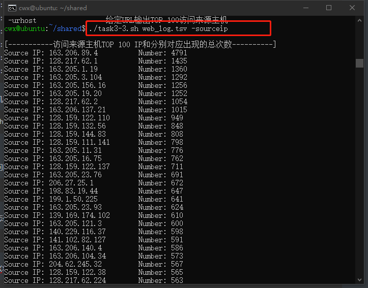
  
    ```bash
    [-----------访问来源主机TOP 100 IP和分别对应出现的总次数----------]
    Source IP: 163.206.89.4          Number: 4791
    Source IP: 128.217.62.1          Number: 1435
    Source IP: 163.205.1.19          Number: 1360
    Source IP: 163.205.3.104         Number: 1292
    Source IP: 163.205.156.16        Number: 1256
    Source IP: 163.205.19.20         Number: 1252
    Source IP: 128.217.62.2          Number: 1054
    Source IP: 163.206.137.21        Number: 1015
    Source IP: 128.159.122.110       Number: 949
    Source IP: 128.159.132.56        Number: 848
    Source IP: 128.159.144.83        Number: 808
    Source IP: 128.159.111.141       Number: 798
    Source IP: 163.205.11.31         Number: 776
    Source IP: 163.205.16.75         Number: 762
    Source IP: 128.159.122.137       Number: 711
    Source IP: 163.205.23.76         Number: 691
    Source IP: 206.27.25.1           Number: 672
    Source IP: 198.83.19.44          Number: 647
    Source IP: 199.1.50.225          Number: 641
    Source IP: 163.205.23.93         Number: 624
    Source IP: 139.169.174.102       Number: 610
    Source IP: 163.205.121.3         Number: 600
    Source IP: 140.229.116.37        Number: 598
    Source IP: 141.102.82.127        Number: 591
    Source IP: 163.206.140.4         Number: 586
    Source IP: 163.206.104.34        Number: 573
    Source IP: 204.62.245.32         Number: 567
    Source IP: 128.159.122.38        Number: 565
    Source IP: 128.217.62.224        Number: 563
    Source IP: 128.159.122.107       Number: 563
    Source IP: 128.159.122.180       Number: 553
    Source IP: 128.159.123.58        Number: 549
    Source IP: 163.205.154.11        Number: 544
    Source IP: 192.112.22.119        Number: 532
    Source IP: 163.205.16.100        Number: 518
    Source IP: 199.201.186.103       Number: 503
    Source IP: 128.159.146.40        Number: 503
    Source IP: 128.159.122.160       Number: 494
    Source IP: 192.77.40.4           Number: 486
    Source IP: 193.143.192.106       Number: 482
    Source IP: 152.163.192.5         Number: 480
    Source IP: 163.205.23.71         Number: 478
    Source IP: 139.169.30.50         Number: 475
    Source IP: 128.159.122.144       Number: 469
    Source IP: 163.234.140.22        Number: 466
    Source IP: 163.205.150.22        Number: 463
    Source IP: 128.217.61.184        Number: 457
    Source IP: 163.205.23.72         Number: 451
    Source IP: 198.83.19.40          Number: 448
    Source IP: 128.159.122.14        Number: 446
    Source IP: 199.201.186.104       Number: 443
    Source IP: 198.83.19.47          Number: 443
    Source IP: 128.217.61.15         Number: 443
    Source IP: 128.159.121.34        Number: 441
    Source IP: 128.159.121.41        Number: 438
    Source IP: 160.205.119.27        Number: 435
    Source IP: 163.205.154.17        Number: 432
    Source IP: 152.163.192.38        Number: 432
    Source IP: 128.159.122.15        Number: 432
    Source IP: 128.159.135.73        Number: 423
    Source IP: 128.159.135.38        Number: 423
    Source IP: 152.163.192.35        Number: 421
    Source IP: 128.159.76.128        Number: 415
    Source IP: 152.163.192.71        Number: 413
    Source IP: 128.159.63.159        Number: 412
    Source IP: 163.205.12.100        Number: 409
    Source IP: 133.53.64.33          Number: 404
    Source IP: 152.163.192.70        Number: 402
    Source IP: 128.159.121.64        Number: 397
    Source IP: 129.239.68.160        Number: 396
    Source IP: 152.163.192.36        Number: 391
    Source IP: 163.205.16.90         Number: 389
    Source IP: 128.32.196.94         Number: 389
    Source IP: 163.205.1.18          Number: 385
    Source IP: 163.206.136.1         Number: 384
    Source IP: 147.147.191.43        Number: 383
    Source IP: 163.205.16.104        Number: 374
    Source IP: 152.163.192.69        Number: 374
    Source IP: 193.178.53.180        Number: 373
    Source IP: 128.217.63.27         Number: 371
    Source IP: 130.110.74.81         Number: 367
    Source IP: 204.69.0.27           Number: 366
    Source IP: 163.206.130.46        Number: 365
    Source IP: 152.163.192.67        Number: 359
    Source IP: 163.205.54.76         Number: 357
    Source IP: 152.163.192.7         Number: 356
    Source IP: 198.83.19.43          Number: 354
    Source IP: 128.159.137.43        Number: 350
    Source IP: 147.74.110.61         Number: 348
    Source IP: 163.205.23.44         Number: 345
    Source IP: 128.159.168.162       Number: 343
    Source IP: 158.27.59.88          Number: 336
    Source IP: 152.163.192.3         Number: 336
    Source IP: 163.205.166.15        Number: 335
    Source IP: 128.159.145.21        Number: 335
    Source IP: 163.205.2.180         Number: 332
    Source IP: 128.217.61.98         Number: 329
    Source IP: 152.163.192.66        Number: 328
    Source IP: 163.205.3.38          Number: 324
    Source IP: 163.205.2.35          Number: 324
    ```
  
  + 统计最频繁被访问的URL TOP 100
  
    ```
    ./task3-3.sh web_log.tsv -fre
    ```
  
    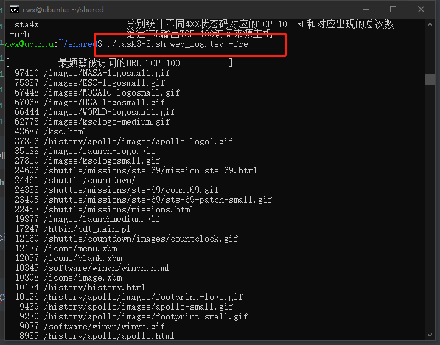
  
    ```bash
    [----------最频繁被访问的URL TOP 100----------]
      97410 /images/NASA-logosmall.gif
      75337 /images/KSC-logosmall.gif
      67448 /images/MOSAIC-logosmall.gif
      67068 /images/USA-logosmall.gif
      66444 /images/WORLD-logosmall.gif
      62778 /images/ksclogo-medium.gif
      43687 /ksc.html
      37826 /history/apollo/images/apollo-logo1.gif
      35138 /images/launch-logo.gif
      27810 /images/ksclogosmall.gif
      24606 /shuttle/missions/sts-69/mission-sts-69.html
      24461 /shuttle/countdown/
      24383 /shuttle/missions/sts-69/count69.gif
      23405 /shuttle/missions/sts-69/sts-69-patch-small.gif
      22453 /shuttle/missions/missions.html
      19877 /images/launchmedium.gif
      17247 /htbin/cdt_main.pl
      12160 /shuttle/countdown/images/countclock.gif
      12137 /icons/menu.xbm
      12057 /icons/blank.xbm
      10345 /software/winvn/winvn.html
      10308 /icons/image.xbm
      10134 /history/history.html
      10126 /history/apollo/images/footprint-logo.gif
       9439 /history/apollo/images/apollo-small.gif
       9230 /history/apollo/images/footprint-small.gif
       9037 /software/winvn/winvn.gif
       8985 /history/apollo/apollo.html
       8662 /software/winvn/wvsmall.gif
       8610 /software/winvn/bluemarb.gif
       8583 /htbin/cdt_clock.pl
       7865 /shuttle/countdown/liftoff.html
       7389 /shuttle/resources/orbiters/orbiters-logo.gif
       7261 /images/shuttle-patch-logo.gif
       7177 /history/apollo/apollo-13/apollo-13.html
       7040 /images/
       7029 /shuttle/countdown/video/livevideo2.gif
       6615 /images/kscmap-tiny.gif
       6517 /shuttle/technology/sts-newsref/stsref-toc.html
       6309 /history/apollo/apollo-13/apollo-13-patch-small.gif
       5613 /shuttle/missions/sts-71/sts-71-patch-small.gif
       5264 /shuttle/missions/sts-69/images/images.html
       5248 /icons/text.xbm
       5093 /images/construct.gif
       4869 /images/shuttle-patch-small.gif
       4846 /shuttle/missions/sts-69/movies/movies.html
       4791 /shuttle/missions/sts-70/sts-70-patch-small.gif
       4785 /icons/unknown.xbm
       4559 /shuttle/missions/sts-69/liftoff.html
       4464 /facilities/lc39a.html
       4434 /shuttle/resources/orbiters/endeavour.html
       4365 /history/apollo/images/apollo-logo.gif
       4066 /shuttle/missions/sts-70/mission-sts-70.html
       4024 /images/lc39a-logo.gif
       3817 /shuttle/resources/orbiters/endeavour-logo.gif
       3706 /shuttle/technology/sts-newsref/sts_asm.html
       3518 /shuttle/countdown/countdown.html
       3507 /shuttle/missions/sts-71/movies/movies.html
       3377 /shuttle/countdown/video/livevideo.jpeg
       3140 /history/apollo/apollo-11/apollo-11.html
       3130 /shuttle/missions/sts-71/mission-sts-71.html
       3087 /shuttle/missions/sts-70/images/images.html
       2945 /shuttle/missions/sts-71/images/images.html
       2939 /shuttle/missions/sts-73/mission-sts-73.html
       2865 /images/faq.gif
       2864 /shuttle/technology/images/srb_mod_compare_1-small.gif
       2818 /shuttle/technology/images/srb_mod_compare_3-small.gif
       2715 /shuttle/technology/images/srb_mod_compare_6-small.gif
       2701 /history/apollo/apollo-11/apollo-11-patch-small.gif
       2586 /elv/elvpage.htm
       2544 /shuttle/missions/sts-73/sts-73-patch-small.gif
       2385 /shuttle/countdown/video/sts-69-prelaunch-pad.gif
       2343 /shuttle/missions/51-l/mission-51-l.html
       2293 /images/launch-small.gif
       2256 /facilities/tour.html
       2201 /shuttle/missions/51-l/51-l-patch-small.gif
       2172 /images/kscmap-small.gif
       2171 /shuttle/resources/orbiters/challenger.html
       2159 /shuttle/missions/sts-71/movies/sts-71-launch.mpg
       2146 /shuttle/technology/sts-newsref/sts-lcc.html
       2133 /htbin/wais.pl
       2120 /facts/about_ksc.html
       2107 /history/mercury/mercury.html
       2040 /images/mercury-logo.gif
       1991 /elv/elvhead3.gif
       1979 /images/launchpalms-small.gif
       1936 /images/whatsnew.gif
       1929 /history/apollo/apollo-spacecraft.txt
       1915 /facilities/vab.html
       1912 /shuttle/resources/orbiters/columbia.html
       1908 /shuttle/countdown/lps/fr.html
       1904 /shuttle/resources/orbiters/challenger-logo.gif
       1892 /images/ksclogo.gif
       1891 /whats-new.html
       1874 /elv/endball.gif
       1869 /history/apollo/apollo-13/apollo-13-info.html
       1868 /shuttle/missions/sts-74/mission-sts-74.html
       1845 /elv/PEGASUS/minpeg1.gif
       1835 /elv/SCOUT/scout.gif
       1827 /images/vab-small.gif
    ```
  
  + 统计不同响应状态码的出现次数和对应百分比
  
    ```bash
    ./task3-3.sh web_log.tsv -sta
    ```
  
    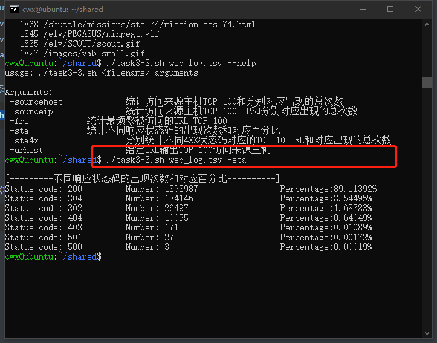
  
    ```bash
    [---------不同响应状态码的出现次数和对应百分比----------]
    Status code: 200         Number: 1398987                 Percentage:89.11392%
    Status code: 304         Number: 134146                  Percentage:8.54495%
    Status code: 302         Number: 26497                   Percentage:1.68783%
    Status code: 404         Number: 10055                   Percentage:0.64049%
    Status code: 403         Number: 171                     Percentage:0.01089%
    Status code: 501         Number: 27                      Percentage:0.00172%
    Status code: 500         Number: 3                       Percentage:0.00019%
    ```
  
  + 分别统计不同4XX状态码对应的TOP 10 URL和对应出现的总次数
  
    ```bash
    ./task3-3.sh web_log.tsv -sta4x
    ```
  
    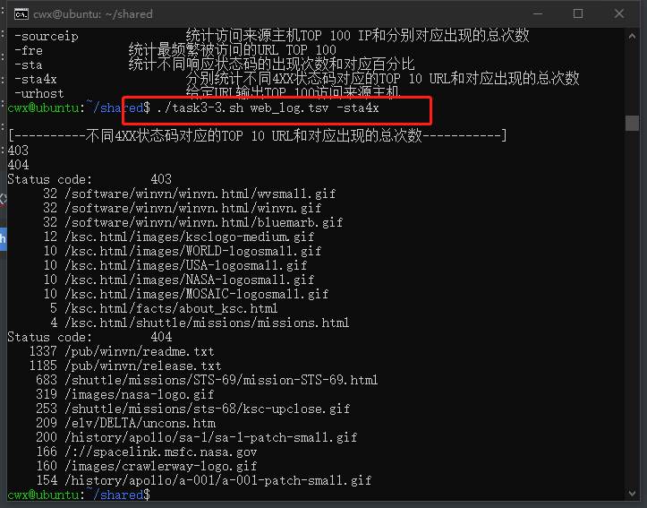
  
    ```bash
    [----------不同4XX状态码对应的TOP 10 URL和对应出现的总次数-----------]
    403
    404
    Status code:        403
         32 /software/winvn/winvn.html/wvsmall.gif
         32 /software/winvn/winvn.html/winvn.gif
         32 /software/winvn/winvn.html/bluemarb.gif
         12 /ksc.html/images/ksclogo-medium.gif
         10 /ksc.html/images/WORLD-logosmall.gif
         10 /ksc.html/images/USA-logosmall.gif
         10 /ksc.html/images/NASA-logosmall.gif
         10 /ksc.html/images/MOSAIC-logosmall.gif
          5 /ksc.html/facts/about_ksc.html
          4 /ksc.html/shuttle/missions/missions.html
    Status code:        404
       1337 /pub/winvn/readme.txt
       1185 /pub/winvn/release.txt
        683 /shuttle/missions/STS-69/mission-STS-69.html
        319 /images/nasa-logo.gif
        253 /shuttle/missions/sts-68/ksc-upclose.gif
        209 /elv/DELTA/uncons.htm
        200 /history/apollo/sa-1/sa-1-patch-small.gif
        166 /://spacelink.msfc.nasa.gov
        160 /images/crawlerway-logo.gif
        154 /history/apollo/a-001/a-001-patch-small.gif
    ```
  
  + 给定URL输出TOP 100访问来源主机
  
    ```bash
    ./task3-3.sh web_log.tsv -urhost /history/apollo/a-001/a-001-patch-small.gif
    ```
  
    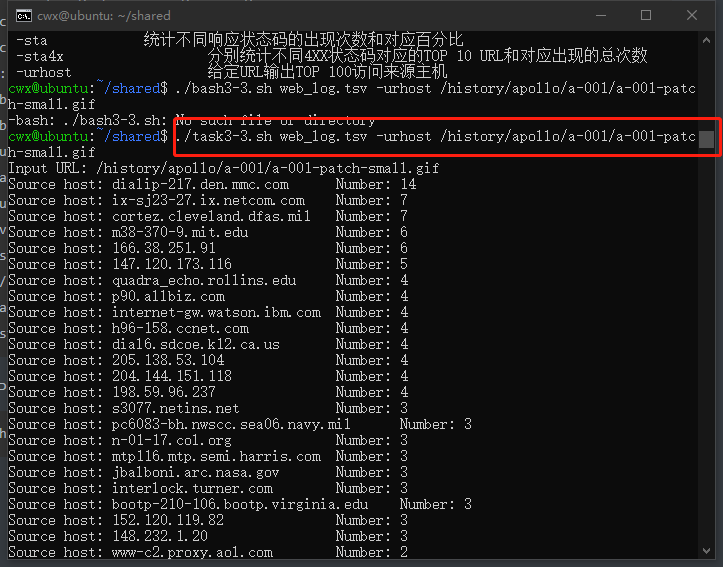
  
    ```bash
    Input URL: /history/apollo/a-001/a-001-patch-small.gif
    Source host: dialip-217.den.mmc.com      Number: 14
    Source host: ix-sj23-27.ix.netcom.com    Number: 7
    Source host: cortez.cleveland.dfas.mil   Number: 7
    Source host: m38-370-9.mit.edu           Number: 6
    Source host: 166.38.251.91               Number: 6
    Source host: 147.120.173.116             Number: 5
    Source host: quadra_echo.rollins.edu     Number: 4
    Source host: p90.allbiz.com              Number: 4
    Source host: internet-gw.watson.ibm.com  Number: 4
    Source host: h96-158.ccnet.com           Number: 4
    Source host: dial6.sdcoe.k12.ca.us       Number: 4
    Source host: 205.138.53.104              Number: 4
    Source host: 204.144.151.118             Number: 4
    Source host: 198.59.96.237               Number: 4
    Source host: s3077.netins.net            Number: 3
    Source host: pc6083-bh.nwscc.sea06.navy.mil      Number: 3
    Source host: n-01-17.col.org             Number: 3
    Source host: mtp116.mtp.semi.harris.com  Number: 3
    Source host: jbalboni.arc.nasa.gov       Number: 3
    Source host: interlock.turner.com        Number: 3
    Source host: bootp-210-106.bootp.virginia.edu    Number: 3
    Source host: 152.120.119.82              Number: 3
    Source host: 148.232.1.20                Number: 3
    Source host: www-c2.proxy.aol.com        Number: 2
    Source host: woozle.eecs.umich.edu       Number: 2
    Source host: tigger.nashscene.com        Number: 2
    Source host: orange.ge.com               Number: 2
    Source host: micks.cis.uoguelph.ca       Number: 2
    Source host: maz3.maz.net                Number: 2
    Source host: manaus.bologna.maraut.it    Number: 2
    Source host: east.ge.com                 Number: 2
    Source host: 199.249.10.2                Number: 2
    Source host: 198.5.212.72                Number: 2
    Source host: 160.205.49.146              Number: 2
    Source host: 150.18.48.11                Number: 2
    Source host: ymdindy1.estec.esa.nl       Number: 1
    Source host: www-d4.proxy.aol.com        Number: 1
    Source host: www-c5.proxy.aol.com        Number: 1
    Source host: www-c3.proxy.aol.com        Number: 1
    Source host: tgiwall.tg-inet.co.jp       Number: 1
    Source host: sloanmac21.mit.edu          Number: 1
    Source host: rmcg.cts.com                Number: 1
    Source host: news.ti.com                 Number: 1
    Source host: lhieb.do.usbr.gov           Number: 1
    Source host: ix-war-mi1-14.ix.netcom.com         Number: 1
    Source host: ix-sj22-16.ix.netcom.com    Number: 1
    Source host: ix-hou5-27.ix.netcom.com    Number: 1
    Source host: intgate.raleigh.ibm.com     Number: 1
    Source host: h-beige.richmond.infi.net   Number: 1
    Source host: hapatia.math.lsu.edu        Number: 1
    Source host: fkirchman.gsfc.nasa.gov     Number: 1
    Source host: dialup07.smartnet.net       Number: 1
    Source host: dial-pl1-13.iway.aimnet.com         Number: 1
    Source host: blooper.ucsb.edu            Number: 1
    Source host: beavis.b11.ingr.com         Number: 1
    Source host: 204.126.162.148             Number: 1
    Source host: 199.1.50.225                Number: 1
    Source host: 152.3.88.45                 Number: 1
    Source host: 152.163.192.38              Number: 1
    Source host: 134.32.21.42                Number: 1
    Source host: 129.243.214.62              Number: 1
    ```
  
    

## 实验总结

+ 任务一实际上是在对shell脚本编程的整体认识，借助`imagemagick`进行各种图像处理操作
+ 任务二则是使用shell脚本编程的知识对数据统计进行一个整体的认识，使用常规的方式进行统计数据
+ 任务三则是使用shell脚本内置的一些函数：类似uniq、sort等等进行排序去重并统计
+ shell脚本编程的架构其实和之前学过的编程语言大致类似，主要注意参数、函数等等的使用，另外还有命令行参数的使用比较常见

## 实验参考资料

+ [bash编程](http://tldp.org/HOWTO/Bash-Prog-Intro-HOWTO.html)
+ [imagemagick](http://xpt.sourceforge.net/techdocs/media/image/imagemagick/im04-TextHandling/ar01s02.html)
+ [virtual box设置共享文件夹](https://blog.csdn.net/milkbusy/article/details/85128180)
+ [在线bahs环境](https://repl.it/@c4pr1c3/LinuxSysAdmin)
+ [imagemagick报错解决](https://www.jianshu.com/p/482f66a93fee)
+ [linux awk](https://www.cnblogs.com/wangbaihan/p/9262296.html)


